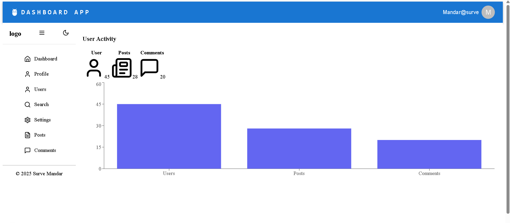
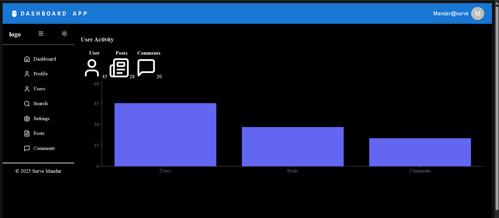

# Data Dashboard App 🚀

An interactive **data dashboard** built with **Next.js, ShadCN UI**, and **Recharts**, featuring authentication, pagination, and dynamic charts.


## 🙋‍♂️ Author
Built with 👨‍💻 by Mandar Surve

## Light Mode



## Dark Mode


## 🌟 Features

- **Authentication** with JWT tokens
- **User, Posts & Comments Table** with pagination
- **Progress Bar** globally implemented in layout
- **Dynamic Bar Chart** powered by Recharts
- **Dark mode support** using Next.js Themes

## 🛠 Installation & Setup

Clone this repository:

```bash
git clone https://github.com/Fawkes73/dash-app.git
cd data-dashboard-app
```

Install dependencies:

```bash
npm install
```

Start development server:

```bash
npm run dev
```

## 📂 Project Structure

- `Layout.tsx` - Ensures Progress Bar appears on every page
- `DashboardCard.tsx` - Includes users, posts, comments, and a Bar Chart
- `pages/` - Contains routes for dashboard & homepage

## 🚀 Technologies Used

- **Next.js** - React Framework
- **ShadCN UI** - Stylized UI components
- **Recharts** - Interactive charting
- **Tailwind CSS** - Responsive styling

## 🤝 Contributing

Feel free to fork this repository, submit issues, or send pull requests! 🎯

📸 UI Preview
Include screenshots or a short GIF here

📄 License
This project is open source under the MIT License.


If you liked this project, give it a ⭐ and share it!

Let me know if you'd like:

- Deploy instructions via **Netlify/Vercel**
- Better screenshots & badge support

Happy Coding 💻🚀

