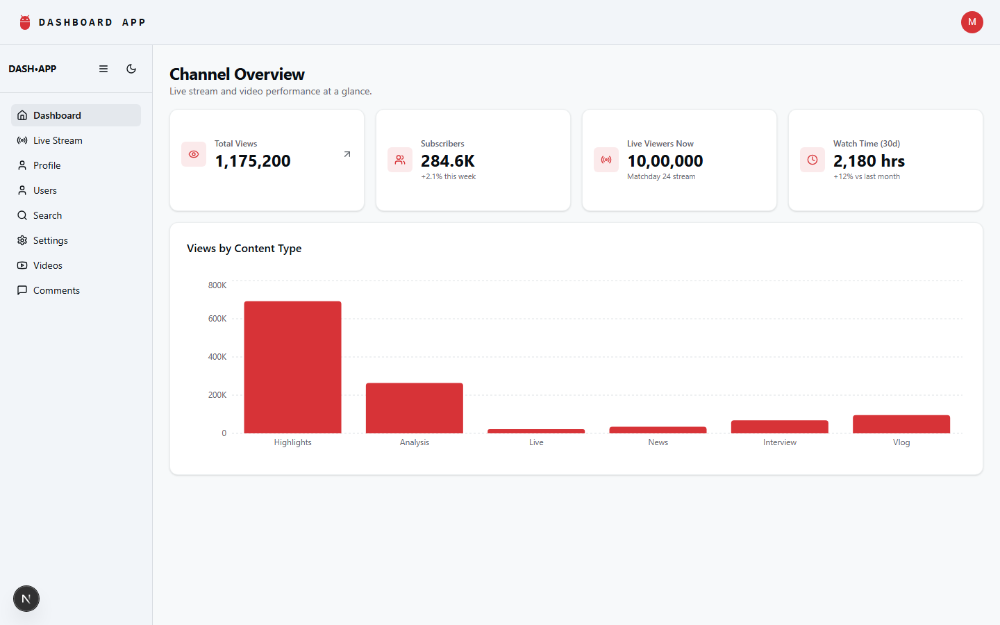
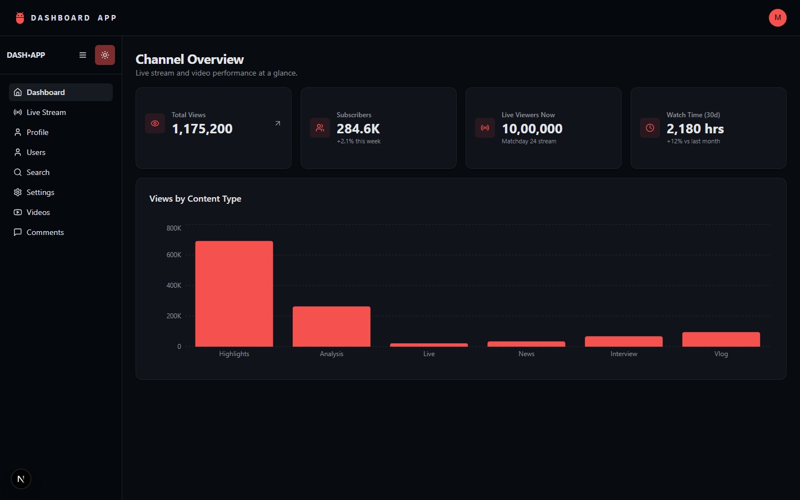
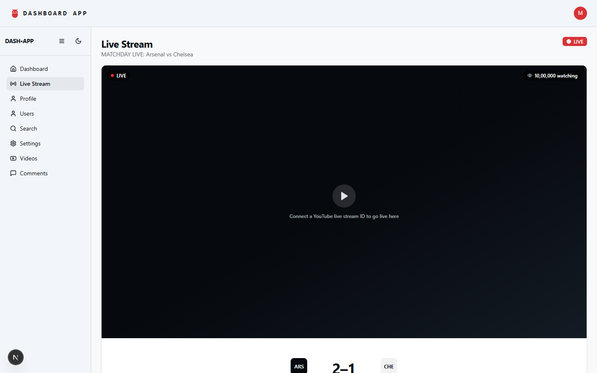

# Data Dashboard App 🚀

A **YouTube channel dashboard** for a football live-stream channel, built with **Next.js, ShadCN UI**, and **Recharts** — channel analytics, a live match stream, a video library, and viewer comments.


## 🙋‍♂️ Author
Built with 👨‍💻 by Mandar Surve

## Light Mode



## Dark Mode


## Live Stream


## 🌟 Features

- **Channel Overview** — subscribers, total views, live viewer count, watch time, and a views-by-category chart derived from the actual video data
- **Live Stream** — YouTube embed slot with a broadcast-style placeholder, live score, match stats, and an event feed
- **Videos & Comments** — a channel video library with pagination and YouTube-style viewer comments
- **User table** with a scrollable list
- **Full light/dark theme** — the whole site switches, including the header and sidebar

## 🛠 Installation & Setup

Clone this repository:

```bash
git clone https://github.com/Fawkes73/dash-app.git
cd dash-app
```

Install dependencies:

```bash
npm install
```

Start development server:

```bash
npm run dev
```

## 📂 Project Structure

- `src/app/Components/Dashboardcard` - Channel Overview: stats + views-by-category chart
- `src/app/Components/LiveStream` - Live stream panel: score, stats, event feed
- `src/app/Components/Videos` / `Comments` - Video library and viewer comments
- `src/app/pages/dashboard` - Dashboard shell: header + sidebar + active section

## 🚀 Technologies Used

- **Next.js** - React Framework
- **ShadCN UI** - Stylized UI components
- **Recharts** - Interactive charting
- **Tailwind CSS** - Responsive styling

## 🤝 Contributing

Feel free to fork this repository, submit issues, or send pull requests! 🎯

📸 UI Preview
Include screenshots or a short GIF here

📄 License
This project is open source under the MIT License.


If you liked this project, give it a ⭐ and share it!

Let me know if you'd like:

- Deploy instructions via **Netlify/Vercel**
- Better screenshots & badge support

Happy Coding 💻🚀

